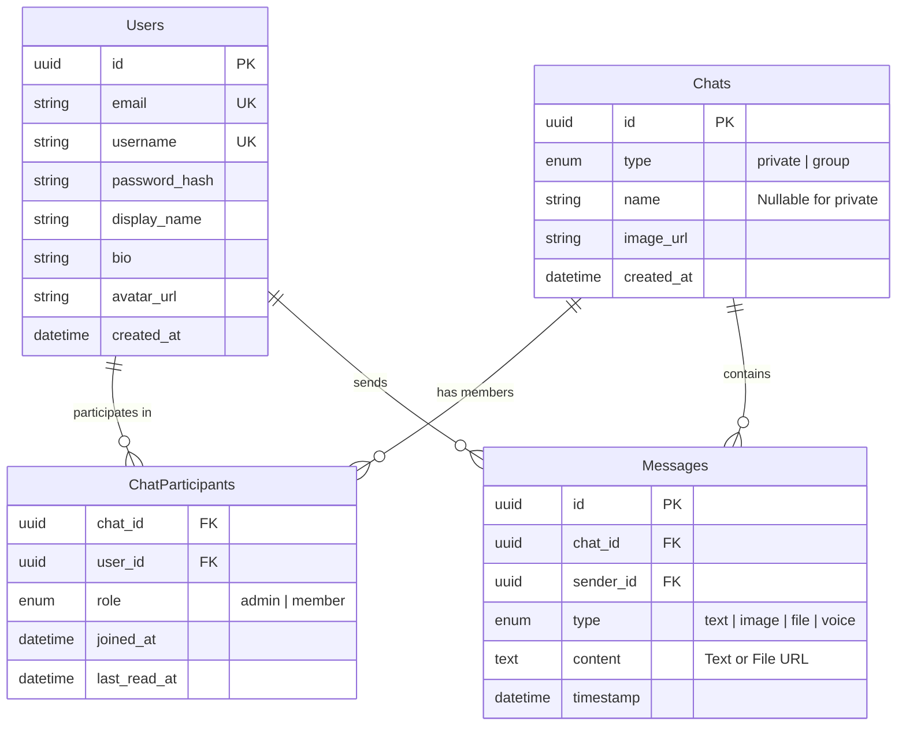

# GLSMSG System Design

This document details the architecture, data models, and communication protocols for the GLSMSG Telegram-like Messenger MVP.

## 1. High-Level Architecture

The system is built as a modernized monolithic architecture, combining REST for CRUD operations and WebSockets for real-time bi-directional messaging, all backed by PostgreSQL and local file storage.

### Components

*   **Client (Frontend):** 
    *   **Tech:** React 19, Vite, TailwindCSS (v4), Zustand.
    *   **Responsibility:** Provides the user interface for authenticating, reading history, sending messages, and receiving real-time updates.
*   **API Gateway & Application Server (Backend):**
    *   **Tech:** Python 3, FastAPI, Uvicorn.
    *   **Responsibility:** Handles HTTP requests (auth, history, uploads), manages WebSocket connections, broadcasts real-time events to connected clients, and orchestrates database operations.
*   **Database (PostgreSQL):**
    *   **Tech:** PostgreSQL 16.
    *   **Responsibility:** Persistent storage for user profiles, chat metadata, and message history. Interacted with via SQLAlchemy (async).
*   **File Storage:**
    *   **Tech:** Local Mounted Volume (`/uploads`).
    *   **Responsibility:** Stores media (images, generic files, voice notes). Abstracted via a `FileStorageService` interface to allow future S3 integration.

## 2. Data Model (Entity-Relationship)



## 3. Communication Protocols

### REST API (Standard Operations)

Used for actions that don't require instant bi-directional streaming.

*   `POST /api/v1/auth/login`: OAuth2 password flow for JWT.
*   `POST /api/v1/auth/register`: Create a new user account.
*   `GET /api/v1/users/me`: Fetch current user profile.
*   `GET /api/v1/users/search?q=...`: Search users by username.
*   `GET /api/v1/chats`: List all chats for the current user.
*   `POST /api/v1/chats`: Create a new chat (1:1 or group).
*   `GET /api/v1/chats/{chat_id}/messages`: Fetch paginated chat history.
*   `POST /api/v1/uploads`: Upload media/voice notes and return a URL.

### WebSockets (Real-Time Events)

The client establishes a persistent connection to `ws://{host}/api/v1/ws/chat?token={jwt}`. 
Messages are sent as stringified JSON payloads.

**Client-to-Server Events:**
*   `send_message`: Send a new message to a chat.
*   `typing_start` / `typing_stop`: Indicate typing activity.
*   `read_receipt`: Update the user's `last_read_at` for a chat.

**Server-to-Client Events:**
*   `new_message`: Broadcasted to all online participants when a message is sent.
*   `user_typing`: Broadcasted to chat participants when someone is typing.
*   `chat_updated`: Notifies when a new chat is created or chat metadata changes.
*   `presence_update`: Notifies when a user goes online/offline (Future).

## 4. Storage Abstraction

To ensure scalability beyond the MVP phase, file uploads are handled via a dependency-injected service:

```python
class FileStorageService(Protocol):
    async def save_file(self, file: UploadFile) -> str: ...
    async def get_file_url(self, filename: str) -> str: ...
```

The MVP uses `LocalFileStorage` writing to `/app/uploads`. A future `S3FileStorage` can implement this protocol without changing the core FastAPI endpoints.

## 5. Security & Considerations

*   **Auth:** JWTs are stateless and expire. Passwords are hashed with bcrypt.
*   **WebSockets Auth:** The JWT is passed as a query parameter during the WS handshake since browsers don't support custom headers in the standard WebSocket API.
*   **Concurrency:** FastAPI's async capabilities with `asyncpg` ensure the server can handle many simultaneous WebSocket connections without blocking the main event loop.
